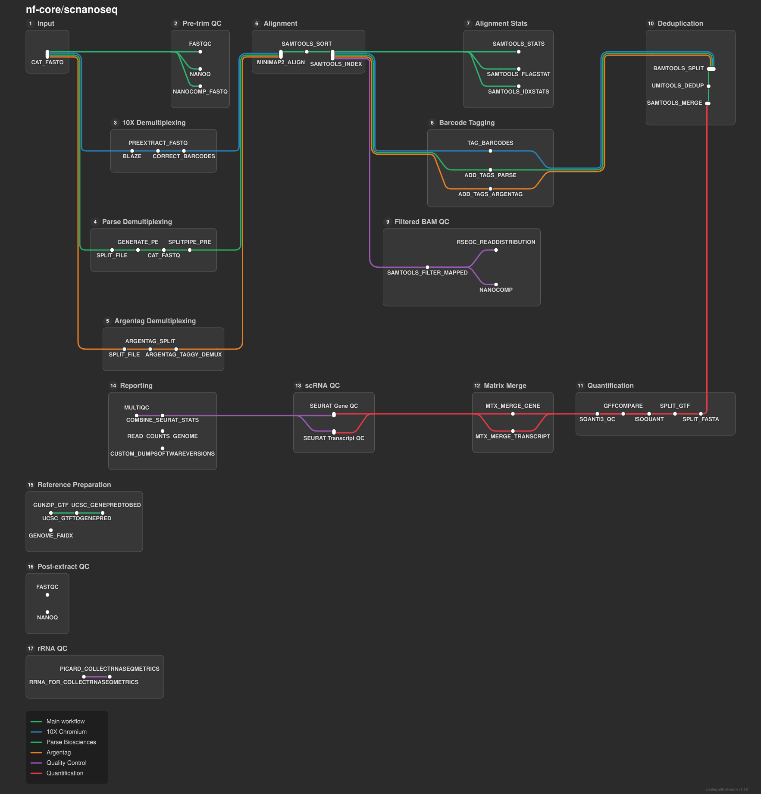

**modify!!** [](https://doi.org/10.5281/zenodo.13899279)

[](https://www.nextflow.io/)
[](https://docs.conda.io/en/latest/)
[](https://www.docker.com/)
[](https://sylabs.io/docs/)
[](https://cloud.seqera.io/launch?pipeline=https://github.com/nf-core/scnanoseq)

## Introduction

**NAME** is a bioinformatics best-practice analysis pipeline for single-cell/nuclei RNA-seq data derived from Ois a b

ioinformatics pipeline for processing single-cell and single-nucleus long-read RNA-seq data generated with Oxford Nanopore sequencing. It supports multiple single-cell technologies, including 10x Genomics (3' and 5' protocols), Argentag, and Parse Biosciences, providing technology-specific preprocessing followed by a unified downstream analysis workflow to enable comparable processing across platforms.

xford Nanopore Q20+ chemistry ([R10.4 flow cells (>Q20)](https://nanoporetech.com/about-us/news/oxford-nanopore-announces-technology-updates-nanopore-community-meeting)). This fork extends the pipeline to support data from multiple single-cell platforms including 10X Genomics (3' and 5' protocols), Argentag, and Parse. Due to the expectation of >Q20 quality, the input data for the pipeline does not depend on Illumina paired data. **Please note that the pipeline can also process Oxford data with older chemistry, but we encourage usage of the Q20+ chemistry when possible**.

The pipeline is built using [Nextflow](https://www.nextflow.io), a workflow tool to run tasks across multiple compute infrastructures in a very portable manner. It uses Docker/Singularity containers making installation trivial and results highly reproducible. The [Nextflow DSL2](https://www.nextflow.io/docs/latest/dsl2.html) implementation of this pipeline uses one container per process which makes it much easier to maintain and update software dependencies. Where possible, these processes have been submitted to and installed from [nf-core/modules](https://github.com/nf-core/modules) in order to make them available to all nf-core pipelines, and to everyone within the Nextflow community!

> **Note**: This is a fork of the [nf-core/scnanoseq](https://github.com/nf-core/scnanoseq) pipeline developed at the Centre for Genomic Regulation (CRG) to add support for Argentag and Parse single-cell platforms. For the original 10X-only version, please refer to the main nf-core repository.


## Installation

The pipeline uses containerization for all dependencies, making installation straightforward:

1. Install [Nextflow](https://www.nextflow.io/docs/latest/getstarted.html) (requires Java 11 or later)
2. Clone this repository:
   ```bash
   git clone https://github.com/biocorecrg/scnanoseq.git
   cd scnanoseq
   ```
3. Run the pipeline with your preferred container engine (Docker or Singularity):
   ```bash
   nextflow run main.nf -profile docker -params-file params.yaml
   ```

That's it! Nextflow will automatically handle downloading and running all required software in containers.

## Pipeline summary



1. Raw read QC ([`FastQC`](https://www.bioinformatics.babraham.ac.uk/projects/fastqc/), [`NanoPlot`](https://github.com/wdecoster/NanoPlot), [`NanoComp`](https://github.com/wdecoster/nanocomp) and [`ToulligQC`](https://github.com/GenomiqueENS/toulligQC))
2. Unzip and split FASTQ ([`pigz`](https://github.com/madler/pigz))
   1. Optional: Split FASTQ for faster processing ([`split`](https://linux.die.net/man/1/split))
3. Trim and filter reads ([`Nanofilt`](https://github.com/wdecoster/nanofilt))
4. Post trim QC ([`FastQC`](https://www.bioinformatics.babraham.ac.uk/projects/fastqc/), [`NanoPlot`](https://github.com/wdecoster/NanoPlot), [`NanoComp`](https://github.com/wdecoster/nanocomp) and [`ToulligQC`](https://github.com/GenomiqueENS/toulligQC))
5. Platform-specific demultiplexing and barcode extraction:
   1. **10X Genomics**: 
      - Barcode detection using 10X whitelist ([`BLAZE`](https://github.com/shimlab/BLAZE))
      - Extract barcodes: Parse FASTQ files into R1 reads containing barcode and UMI and R2 reads containing sequencing without barcode and UMI (custom script `./bin/pre_extract_barcodes.py`)
      - Barcode correction (custom script `./bin/correct_barcodes.py`)
   2. **Argentag**:
      - Chimera splitting (custom script)
      - Demultiplexing using taggy_demux (v1.1)
   3. **Parse**:
      - Generate artificial paired-end reads using parse_pe_ont (v4.0)
      - Demultiplexing using split-pipe (v1.6.1)
6. Post-extraction QC ([`FastQC`](https://www.bioinformatics.babraham.ac.uk/projects/fastqc/), [`NanoPlot`](https://github.com/wdecoster/NanoPlot), [`NanoComp`](https://github.com/wdecoster/nanocomp) and [`ToulligQC`](https://github.com/GenomiqueENS/toulligQC))
7. Alignment to the genome, transcriptome, or both ([`minimap2`](https://github.com/lh3/minimap2))
8. Post-alignment filtering of mapped reads and gathering mapping QC ([`SAMtools`](http://www.htslib.org/doc/samtools.html))
9. Post-alignment QC in unfiltered BAM files ([`NanoComp`](https://github.com/wdecoster/nanocomp), [`RSeQC`](https://rseqc.sourceforge.net/))
10. Barcode (BC) tagging with read quality, BC quality, UMI quality (custom script `./bin/tag_barcodes.py`)
11. Read deduplication ([`UMI-tools`](https://github.com/CGATOxford/UMI-tools) OR [`Picard MarkDuplicates`](https://broadinstitute.github.io/picard/))
12. Gene and transcript level matrices generation with [`IsoQuant`](https://github.com/ablab/IsoQuant) and/or transcript level matrices with [`oarfish`](https://github.com/COMBINE-lab/oarfish)
13. Preliminary matrix QC ([`Seurat`](https://github.com/satijalab/seurat))
14. Compile QC for raw reads, trimmed reads, pre and post-extracted reads, mapping metrics and preliminary single-cell/nuclei QC ([`MultiQC`](http://multiqc.info/))

## Usage

> [!NOTE]
> If you are new to Nextflow and nf-core, please refer to [this page](https://nf-co.re/docs/usage/installation) on how to set-up Nextflow. Make sure to [test your setup](https://nf-co.re/docs/usage/introduction#how-to-run-a-pipeline) with `-profile test` before running the workflow on actual data.

### Prepare your samplesheet

First, prepare a samplesheet with your input data that looks as follows:

```csv title="samplesheet.csv"
sample,fastq,cell_count
CONTROL_REP1,AEG588A1_S1.fastq.gz,5000
CONTROL_REP1,AEG588A1_S2.fastq.gz,5000
CONTROL_REP2,AEG588A2_S1.fastq.gz,5000
CONTROL_REP3,AEG588A3_S1.fastq.gz,5000
CONTROL_REP4,AEG588A4_S1.fastq.gz,5000
CONTROL_REP4,AEG588A4_S2.fastq.gz,5000
CONTROL_REP4,AEG588A4_S3.fastq.gz,5000
```

Each row represents a single-end fastq file. Rows with the same sample identifier are considered technical replicates and will be automatically merged. `cell_count` refers to the expected number of cells you expect.

### Run the pipeline with platform-specific parameters

The pipeline supports three single-cell sequencing platforms. Use the appropriate parameter file for your platform:

#### 10X Genomics 3' Protocol

Key parameters:
- `platform`: "10X"
- `barcode_format`: "10X_3v4" (alternatives: "10X_3v3")

```bash
nextflow run main.nf \
   -profile <docker/singularity/.../institute> \
   -params-file test_input/params_10X_3prime.yaml
```

#### 10X Genomics 5' Protocol

Key parameters:
- `platform`: "10X"
- `barcode_format`: "10X_5v3" (alternatives: "10X_5v2")

```bash
nextflow run main.nf \
   -profile <docker/singularity/.../institute> \
   -params-file test_input/params_10X_5prime.yaml
```

#### Argentag Platform

Key parameters:
- `platform`: "Argentag"
- `argentag_taggy_demux`: taggy_demux command options (e.g., "--out-fmt='flames' --trim-TSO --preserve --trim-poly 'normal' --orient 'sense' --keep-failed")

```bash
nextflow run main.nf \
   -profile <docker/singularity/.../institute> \
   -params-file test_input/params_argentag.yaml
```

#### Parse Platform

Key parameters:
- `platform`: "Parse"
- `parse_generate_pe`: parse_pe_ont command options (e.g., "--chemistry v3 --l1dist 3 --l2dist 2")
- `parse_spipe`: split-pipe command options (e.g., "--chemistry v3 --kit WT_mini")

```bash
nextflow run main.nf \
   -profile <docker/singularity/.../institute> \
   -params-file test_input/params_parse.yaml
```

> [!WARNING]
> Please provide pipeline parameters via the CLI or Nextflow `-params-file` option. Custom config files including those provided by the `-c` Nextflow option can be used to provide any configuration _**except for parameters**_; see [docs](https://nf-co.re/docs/usage/getting_started/configuration#custom-configuration-files).

For more details and further functionality, please refer to the parameter files in the `test_input` directory and the [original nf-core scnanoseq documentation](https://nf-co.re/scnanoseq).

## Pipeline output

This pipeline produces feature-barcode matrices as the main output, regardless of the sequencing platform used (10X, Argentag, or Parse). These feature-barcode matrices are able to be ingested directly by most packages used for downstream analyses such as `Seurat`. Additionally, the pipeline produces a number of quality control metrics to ensure that the samples processed meet expected metrics for single-cell/nuclei data.

### Main output directories

The pipeline generates outputs organized in the following directory structure:

```
results/
├── <sample_identifier>/
│   ├── qc/                          # Quality control reports
│   │   ├── fastqc/                 # FastQC reports
│   │   ├── nanoplot/               # NanoPlot reports
│   │   ├── toulligqc/              # ToulligQC reports
│   │   ├── rseqc/                  # RSeQC reports
│   │   └── seurat/                 # Seurat QC plots
│   ├── genome/                      # Genome-aligned outputs
│   │   ├── bam/                    # BAM files (original, mapped, tagged, deduplicated)
│   │   ├── isoquant/               # Gene and transcript matrices (IsoQuant)
│   │   └── qc/                     # Samtools and mapping statistics
│   └── transcriptome/               # Transcriptome-aligned outputs
│       ├── bam/                    # BAM files (original, mapped, tagged, deduplicated)
│       ├── oarfish/                # Transcript matrices (oarfish)
│       └── qc/                     # Samtools and mapping statistics
├── batch_qcs/
│   ├── nanocomp/                   # NanoComp reports comparing all samples
│   └── read_counts/                # Read count statistics
├── multiqc/                         # MultiQC aggregated report
└── pipeline_info/                   # Nextflow execution reports
```

### Quantification matrices

The pipeline produces feature-barcode matrices using two available tools:

- **IsoQuant**: Requires genome fasta; produces gene-level and transcript-level HDF5 matrices
- **oarfish**: Requires transcriptome fasta; produces transcript-level matrices in Matrix Market format

Users can choose to run both tools or just one via the `quantifier` parameter.

### Key output files

- `*.h5`: Feature-barcode matrices in HDF5 format (IsoQuant)
- `matrix.mtx.gz`, `barcodes.tsv.gz`, `features.tsv.gz`: Feature-barcode matrices in Matrix Market format (oarfish)
- `*.tagged.bam`: BAM files with barcode and UMI tags
- `*.dedup.bam`: Deduplicated BAM files (with corrected barcodes)
- `multiqc_report.html`: Interactive QC report summarizing all pipeline results

For a comprehensive description of all output files and directories, please refer to the [complete output documentation](docs/output.md).

## Datasets

### Full datasets used in the study

The following datasets were used to develop and benchmark the pipeline:

| Platform | Sample | Input reads | ENA ID |
|----------|--------|-------------|--------|
| 10X-3prime | 10X-3prime Rep1 | 271,541,720 | [ENA accession] |
| 10X-3prime | 10X-3prime Rep2 | 308,376,426 | [ENA accession] |
| 10X-3prime | 10X-3prime Rep3 | 298,694,391 | [ENA accession] |
| 10X-5prime | 10X-5prime Rep1 | 181,076,926 | [ENA accession] |
| 10X-5prime | 10X-5prime Rep2 | 256,241,535 | [ENA accession] |
| 10X-5prime | 10X-5prime Rep3 | 239,552,419 | [ENA accession] |
| Argentag | Argentag Rep1 | 190,023,577 | [ENA accession] |
| Argentag | Argentag Rep2 | 167,392,677 | [ENA accession] |
| Argentag | Argentag Rep3 | 137,990,113 | [ENA accession] |
| Parse | Parse Rep1 | 204,122,101 | [ENA accession] |
| Parse | Parse Rep2 | 379,870,956 | [ENA accession] |
| Parse | Parse Rep3 | 412,205,016 | [ENA accession] |

**Analysis workflow:**

The complete analysis was performed using four separate pipeline runs, one for each platform. In each run, the samplesheet contained all three replicates for that platform. Each pipeline execution required between 36 and 72 hours to complete, with runtime variation depending on resource availability and system load on the HPC cluster.

**Reference genomes:**

The analysis was performed using combined reference genomes obtained from Ensembl (v111):
- Human: *Homo_sapiens.GRCh38.dna.fa*
- Mouse: *Mus_musculus.GRCm39.dna.fa*
- Dog: *Canis_lupus_familiaris.ROS_Cfam_1.0.dna.fa*

### Test datasets

Test datasets have been created for quick pipeline validation and testing. These datasets were generated by subsampling the full datasets to reduce computational requirements.

**Generation method:**

Test datasets were created from Rep1 of each platform dataset using the following command:

```bash
seqkit sample -n 1000000 -s 42 input.fastq.gz > test_dataset.fastq.gz
```

This command randomly samples 1,000,000 reads from the original full datasets using a fixed seed (`-s 42`) to ensure reproducibility.

> **Note:** Test datasets are not included in this repository due to their size. You can generate them yourself using the command above with the same seed value to create reproducible test datasets.

**Test dataset specifications and runtime on CRG HPC:**

| Platform | Sample | Number of reads | Wall-clock time |
|----------|--------|-----------------|-----------------|
| 10X-3prime | 10X-3prime Rep1 | 1,000,000 | 10h |
| 10X-5prime | 10X-5prime Rep1 | 1,000,000 | 8h |
| Argentag | Argentag Rep1 | 1,000,000 | 4h |
| Parse | Parse Rep1 | 1,000,000 | N/A |

> **Note on Parse test datasets:** The Parse platform requires a minimum of 1,000,000 reads as input to split-pipe for proper functionality. However, due to read loss during preprocessing (barcode extraction and quality filtering), a 1,000,000 read test dataset may result in fewer than the required reads reaching split-pipe. For reliable testing of the Parse platform, it is recommended to use larger test datasets (≥2,000,000 reads) or full datasets. Users can adjust the seqkit sampling command accordingly: `seqkit sample -n 2000000 -s 42 input.fastq.gz > test_dataset.fastq.gz`

> *Runtime on CRG HPC. Actual runtime may vary depending on system load, hardware configuration, and input data characteristics.*

**Running test datasets:**

Once you have generated the test datasets using the seqkit command above, you can run the pipeline with the provided parameter and samplesheet files. For example, to run the 10X 3' test dataset:

```bash
nextflow run main.nf \
   -profile <docker/singularity/.../institute> \
   -params-file test_input/params_10X_3prime.yaml \
   --input test_input/samplesheet_10X_3prime.csv
```

The same approach applies to the other platforms (10X 5', Argentag, and Parse) by substituting the corresponding parameter and samplesheet files:
- 10X 5': `params_10X_5prime.yaml` and `samplesheet_10X_5prime.csv`
- Argentag: `params_argentag.yaml` and `samplesheet_argentag.csv`
- Parse: `params_parse.yaml` and `samplesheet_parse.csv`

All parameter and samplesheet files for running the test datasets can be found in the `test_input/` directory.

## Troubleshooting

If you experience any issues, please make sure to [open an issue on our GitHub repository](https://github.com/biocorecrg/scnanoseq/issues/new/choose). However, some resolutions for common issues will be noted below:

- Due to the nature of the data this pipeline analyzes, some tools may experience increased runtimes. For some of the custom tools made for this pipeline (`preextract_fastq.py` and `correct_barcodes.py`), we have leveraged the splitting done via the `split_amount` parameter to decrease their overall runtimes. The `split_amount` parameter will split the input FASTQs into a number of FASTQ files, each containing a number of lines based on the value used for this parameter. As a result, it is important not to set this parameter to be too low as doing so would cause the creation of a large number of files the pipeline will be processed. While this value can be highly dependent on the data, a good starting point for an analysis would be to set this value to `500000`. If you find that `PREEXTRACT_FASTQ` and `CORRECT_BARCODES` are still taking long amounts of time to run, it would be worth reducing this parameter to `200000` or `100000`, but keeping the value on the order of hundred of thousands or tens of thousands should help with keeping the total number of processes minimal. An example of setting this parameter to be equal to 500000 is shown below:

```yml title="params.yml"
split_amount: 500000
```

- We have seen a recurrent node failure on slurm clusters that does seem to be related to submission of Nextflow jobs. This issue is not related to this pipeline per se, but rather to Nextflow itself. We are currently working on a resolution. But we have two methods that appear to help overcome should this issue arise:
  1. Provide a custom config that increases the memory request for the job that failed. This may take a couple attempts to find the correct requests, but we have noted that there does appear to be a memory issue occasionally with these errors.
  2. Request an interactive session with a decent amount of time and memory and CPUs in order to run the pipeline on the single node. Note that this will take time as there will be minimal parallelization, but this does seem to resolve the issue.
- We note that umitools dedup can take a large amount of time in order to perform deduplication. One approach we have implemented to assist with speed is to split input files based on chromosome. However for the transcriptome aligned bams, there is some additional work required that involves grouping transcripts into appropriate chromosomes. In order to accomplish this, the pipeline needs to parse the transcript id from the transcriptome FASTA file. The transcript id is often nested in the sequence identifier with additional data and the data is delimited. We have included the delimiters used by reference files obtained from GENCODE, NCBI, and Ensembl. However in case you wish to explicitly control this or if the reference file source uses a different delimiter, you are able to manually set it via the `--fasta_delimiter` parameter.
- We acknowledge that analyzing PromethION data is a common use case for this pipeline. Currently, the pipeline has been developed with defaults to analyze GridION and average sized PromethION data. For cases, where jobs have fail due for larger PromethION datasets, the defaults can be overwritten by a custom configuation file (provided by the `-c` Nextflow option) where resources can be increased (substantially in some cases). Below are some of the overrides we have used, and while these amounts may not work on every dataset, these will hopefully at least note which processes will need to have their resources increased:

```groovy title="custom.config"

process
{
    withName: '.*:.*FASTQC.*'
    {
        cpus = 20
    }
}

process
{
    withName: '.*:BLAZE'
    {
        cpus = 30
    }
}

process
{
    withName: '.*:TAG_BARCODES'
    {
        memory = '60.GB'
    }
}

process
{
    withName: '.*:SAMTOOLS_SORT'
    {
        cpus = 20
    }
}

process
{
    withName: '.*:MINIMAP2_ALIGN'
    {
        cpus = 20
    }
}

process
{
    withName: '.*:ISOQUANT'
    {
        cpus = 30
        memory = '85.GB'
    }
}
```

We further note that while we encourage the use of `split_amount` as discussed above for larger datasets, the pipeline can be executed without enabling this parameter. When doing this, please consider increasing the time limit to `CORRECT_BARCODES` as it can take hours instead of minutes when `split_amount` is disabled:

```groovy title="custom.config"
//NOTE: with split_amount disabled, consider increasing the time limit to CORRECT_BARCODES
process
{
    withName: '.*:CORRECT_BARCODES'
    {
        time = '15.h'
    }
}
```

### Platform-specific considerations

- **Argentag**: The `ARGENTAG_TAGGY_DEMUX` process can be memory-intensive for large datasets. If you experience memory errors, consider increasing the memory allocation for this process in a custom config file.
- **Parse**: The `SPLITPIPE_PRE` process requires significant computational resources. Ensure that adequate CPU and memory are allocated. The `split_amount` parameter can help improve performance by parallelizing the processing across multiple chunks.
- **10X**: For 10X data, the `BLAZE` barcode detection step can benefit from increased CPU allocation. The `CORRECT_BARCODES` process may also require additional resources for very large datasets.

## Credits

nf-core/scnanoseq was originally written by [Austyn Trull](https://github.com/atrull314), and [Dr. Lara Ianov](https://github.com/lianov).

This fork of the scnanoseq pipeline was developed by **Anna Delgado** from the Bioinformatics Unit at the Centre for Genomic Regulation (CRG) to extend support for additional single-cell sequencing platforms (Argentag and Parse).

We would also like to thank the following people and groups for their support, including financial support:

- Dr. Elizabeth Worthey
- University of Alabama at Birmingham Biological Data Science Core (U-BDS), RRID:SCR_021766, <https://github.com/U-BDS>
- Civitan International Research Center
- Support from: 3P30CA013148-48S8

## Citations

If you use nf-core/scnanoseq for your analysis, please cite the article as follows:

> **scnanoseq: an nf-core pipeline for Oxford Nanopore single-cell RNA-sequencing**
>
> Austyn Trull, nf-core community, Elizabeth A. Worthey, Lara Ianov
>
> bioRxiv 2025.04.08.647887; doi: https://doi.org/10.1101/2025.04.08.647887

The specific pipleine version can be cited using the following doi: [10.5281/zenodo.13899279](https://doi.org/10.5281/zenodo.13899279)

An extensive list of references for the tools used by the pipeline can be found in the [`CITATIONS.md`](CITATIONS.md) file.

You can cite the `nf-core` publication as follows:

> **The nf-core framework for community-curated bioinformatics pipelines.**
>
> Philip Ewels, Alexander Peltzer, Sven Fillinger, Harshil Patel, Johannes Alneberg, Andreas Wilm, Maxime Ulysse Garcia, Paolo Di Tommaso & Sven Nahnsen.
>
> _Nat Biotechnol._ 2020 Feb 13. doi: [10.1038/s41587-020-0439-x](https://dx.doi.org/10.1038/s41587-020-0439-x).
